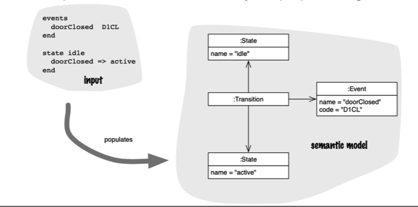

# Semantic Model

Tem de existir um modelo da linguagem a usar para a resolução do problema, bem como de uma `DSL` (*Domain Specific Language*) para garantir que está tudo dentro dos conformes do sistema. 

A DSL permite popular a máquina de estados e a `Symbol Table` do problema, especificando tudo o que é possível e o que não é possível fazer na linguagem. Assim há uma clara separação do que é o passo de parsing e o resultado semântico resultante, podendo testar o modelo independentemente da linguagem usada.

