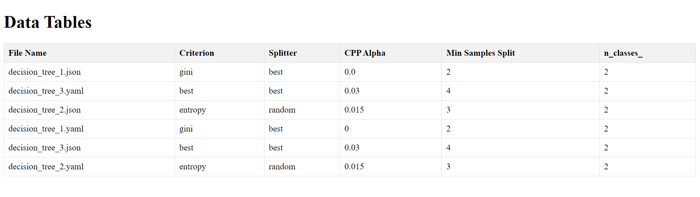

# ELS2024-3: CheckPoint 1

## Introduction

It was proposed to the group create a basic version of a Domain-Specific Language (DSL) for extracting, manipulating and writing of tabular data from arbitrary sources, such as JSON, YAML, or XML files.

This DSL reads a configuration file which specifies how to import, process, and export data from the tables extracted from the data sources.

This README contains a section for explaining the structure of the configuration file, a brief description of the major components of the DSL created, as well as the features language is capable of, and the concerns reflected during the its development and the conclusions.

- [Configuration File](#configuration-file)
- [DSL architecture](#dsl-architecture)
    - [Parser](#parser)
    - [Processor](#processor)
    - [Exporter](#exporter)
- [Features](#features)
- [Error handling](#error-handling)
- [Known issues and Limitations](#known-issues-and-limitations)
- [User Profile](#user-profile)
- [Conclusions and Future Work](#conclusions-and-future-work)

## Configuration file

This DSL reads a configuration file in JSON, which contains 3 major objects, the ```general```, the ```process```, and the ```export```, which are represented by the Java classes ```GeneralConfig```, ```ProcessConfig```, and ```ExportConfig```.

The ```general``` object specifies the directory of the resources to be used for extraction, as well as the target directory for the output files created. The following snippet of code shows how those directories can be specified in our configuration file:

```json
"general": {
    "input_folder": "resources/assignment_1/input/",
    "output_folder": "resources/assignment_1/output/"
}
```

<p style="text-align: center;">Code snippet 1: general object's structure.</p>

The ```process``` element indicates the operations to be executed and the respective arguments for which one. This operations are represented as a ```ProcessUnit```, which have the following attributes:

- ```type```: the type of operation that can be executed;
- ```args```: the arguments for that operation.

The latter element doesn't have a strict form for every operation: for instance, adding a new column operation needs the "name" and the "content" argument, which indicate the name of the new column, and the content to be inserted in that column, respectively.
On the other hand, the rename operation have the "column" argument, indicating the column to be renamed (and optionally, it can be used the "attributes" arguments, to rename the specified attributed nested in tha column).

The following snippet of code illustrates how the ```process``` element can be composed:

```java

"process": [
        {
            "type": "Rename",
            "args": {
                "column": "params",
                "attributes": {
                    "criterion": "Criterion",
                    "splitter": "Splitter",
                    "ccp_alpha": "CPP Alpha",
                    "min_samples_split": "Min Samples Split"
                }
            }
        },
        {
            "type": "AddCol",
            "args": {
                "name": "File Name",
                "content": "FILENAME"
            }
        },
        {
            "type": "Sum",
            "args": {
                "name": "Test",
                "cols": ["n_features_", "n_outputs_"]
            }
        }
    ]
```

<p style="text-align: center;">Code snippet 2: Project's object structure.</p>

Finally, the ```export``` object specifies the content to be exported after processing data from the tables.
This element is also a list of objects, where each object specifies the columns to be exported,
with the desired name for each one in the "columns" attribute, which will be written to the output file indicated in the "output_file" component.

Each component represents an ```ExportUnit```, which will be useful for Export part.

The snippet of code below shows how the export element can be written:

```java
"export": [
        {
            "columns": [
                {
                    "name": "File Name"
                },
                {
                    "name": "Criterion"
                },
                {
                    "name": "Splitter"
                },
                {
                    "name": "CPP Alpha"
                },
                {
                    "name": "Min Samples Split"
                },
                {
                    "name": "n_classes_"
                }
            ],
            "output_file": "output.csv"
        }
    ]
```

<p style="text-align: center;">Code snippet 3: Export's object structure.</p>

With this organized strucure, each component is isolated from the other ones, bringing modularity to the file's processing,
and accomplishing the desired structure for the configuration file.

<div style="text-align: center;">
    
    <p>Image 1: Configuration file overview.</p>
</div>


## DSL architecture

Viewing in a high-level perspective, the DSL is composed by 3 main modules: the parser, the processor, and the exporter. These components have independent tasks that, when used together, they can process the sources files according to the specifications present in the cofiguration's file. This section will explain how the 3 modules are constituted, and the tasks they are responsible for.

The following image illustrated an high-level overview of the DSL's architecture:

<div style="text-align: center;">
    
    <p>Image 2: DLS's UML.</p>
</div>

### Parser

The parser is responsible collecting the tables and columns for the input files present in the
"input_folder" defined in configuration file.

Since each file can either be in JSON, XML, or YAML, the parser will instantiate the respective parser for each file (a ```JSONParser```, ```XMLParser``` or ```YAMLParser```, respectively). The only difference between them is the the ObjectMapper used for the respective file extension.

Each parser extends the ```FileParser```, an abstract class that has the actual logic behind the parser, in its ```parse_helper()``` method: the parsers will go through the file and collect recursively the key and value pairs, mapping the name of the columns of the table with the values associated to it. If the value is not a primitive one (that is, it is another object). It will call the ```parse_helper()``` method with the that value, and the column's name as its parameters, returning a Map String (which is the file) and the Attribute (the column's data). This is essential to make that every single element could be easily accessed in O(1) time complexity, facilitating navigation through the input file's tree structure without representing it.

The content of the parser could be visualized as this map object: 

<div style="text-align: center;">
    
    <p>Image 3: Content generated from the parser.</p>
</div>

### Processor

The processor element is in charge of transform the data extracted from the tables, by executing the operations present in the configuration file. In this checkpoint, the processor is capable of the following operations:

- Sum (represented by the type ```SUM```);
- Subtraction (represented by the type ```SUB```);
- Multiplication (represented by the type ```MULT```);
- Division (represented by the type ```DIV```);
- Add new column (represented by the type ```ADDCOL```);
- Rename column (represented by the type ```RENAME```);

After the ```ProcessConfig``` extracts the columns and/or the tables to be processed (represented as objects of ```ProcessUnit```), the Processor iterates over them and performs the operations indicated, according to its type.
In case of the process unit being as an mathematical operation it uses the ```performOperation()``` method to execute the operation itself.
The process logic can be visualised in the ```process()``` method below:

```java
public Map<String, Map<String, Attribute>> process() throws ProcessException {
    List<ProcessUnit> processes = config.getProcessConfig().getProcesses();

    for (ProcessUnit process : processes) {
        Map<String, Object> args = process.getArgs();
        Operation type = process.getType();
        String name = (String) args.get("name");
        String col_content = (String) args.get("content");
        List<String> cols = (List<String>) args.get("cols");
        Map<String, String> attributes = (Map<String, String>) args.get("attributes");

        switch (type) {
            case RENAME -> this.rename(attributes);
            case ADDCOL -> this.addCol(name, col_content);
            case SUM -> this.performOperation(cols, name, Operation.SUM, 0);
            case SUB -> this.performOperation(cols, name, Operation.SUB, 0);
            case DIV -> this.performOperation(cols, name, Operation.DIV, 1);
            case MULT -> this.performOperation(cols, name, Operation.MULT, 1);
            default -> throw new ProcessException("Unknown process type: " + type);
        }
    }

    return this.content;
}

public void performOperation(List<String> col_names, String final_col_name, Operation type, Integer res) throws ProcessException {
    for (String filename : this.content.keySet()) {
        Map<String, Attribute> attributes = this.content.get(filename);

        for (String colName : col_names) {
            Attribute targetAttribute = attributes.get(colName);
            if (targetAttribute == null) {
                throw new ProcessException("Unknown attribute name: " + colName);
            }

            Integer value = (Integer) targetAttribute.getValue();
            switch (type) {
                case SUM -> res += value;
                case SUB -> res -= value;
                case DIV -> res = value / res;
                case MULT -> res *= value;
                default -> throw new ProcessException("Unknown operation type: " + type);
            }
        }

        Attribute attribute = new Attribute(final_col_name, filename, res);
        this.content.get(filename).put(final_col_name, attribute);
    }
}
```

<p style="text-align: center;">Code snippet 4: process() and performOperation() methods, the main ones from the Processor class.</p>

This ensures that the operations are executed in the reasonable time and space complexity (O(N), where N is the number of the operations to be performed), as well as being isolated from the steps of the data processing.

### Exporter

The last element of the Domain-Specific Language architecture's created is the exporter. Similarly to the processor, it extracts the ```ExportUnits``` from ```ExportConfig```, it go trough all the units and export them into an output file, according to the extension specified in each unit. Based on that, it will either create an ```HTMLExporter``` or an ```CSVExporter```, as it is visible on the ```export()``` method below:

```java
public void export() throws IOException, ExportException {

    List<ExportUnit> exportUnits = this.config.getExportConfig().getExportUnits();
    
    for (ExportUnit exportUnit : exportUnits) {

        String outputFile = exportUnit.getOutputFile();
        String extension = exportUnit.getExtension();

        FileExporter fileExporter;
        switch (extension) {
            case "html" -> fileExporter = new HTMLExporter(content);
            case "csv" -> fileExporter = new CSVExporter(content);
            default -> throw new ExportException("Unsupported export file format: " + extension);
        }

        List<Column> columns = exportUnit.getColumnsToBeExported();
        List<String> columnsToBeExported = new ArrayList<>();
        for (Column column : columns) {
            columnsToBeExported.add(column.getName());
        }

        String data = fileExporter.export(columnsToBeExported);
        try (FileWriter writer = new FileWriter(this.outputFolder + outputFile)) {
            writer.write(data);
        }
    }
}
```
<p style="text-align: center;">Code snippet 5: export() method.</p>

The final result of this process is either an HTML or CSV table with the columns selected to be exported as we can see in the image below:

<div style="text-align: center;">
    
    <p>Image 4: exported tables displayed in HTML.</p>
</div>

As a result, it also brings the modularity needed to isolate the exportation task from the other ones, as well as some versatility on the resulted outputs, letting the user decide what and how to export the data processed from the transformed tables.

## Features

As we could see in the architecture, it Domain-Specific Language working with the configuration file has several features associated, such as:

- Multiple tables extracted from different input file formats (JSON, YAML, XML);
- Different kind of operations, such as:

    - Summing numbers;
    - Subtracting numbers;
    - Multiplying numbers;
    - Dividing numbers;
    - Adding a new column;
    - Renaming column (represented by the type ```RENAME```); 
- Columns/tables exportation in HTML or CSV formats.

Each operation creates, in fact, a new column. This means that adding a new column will only information related to the input file associated for each row in the output table. At the moment, it can only be added the following pieces of information:

- File's name, represented in the "content" argument as "FILENAME";
- File's extension, represented in the "content" argument as "FILEEXTENSION";

If the other keyword is used, an error is thrown by the error.
The exportation is only limited to the HTML or the CSV formats for the outputs files. If other extension for the file is indicated in the configuration file, an error will be thrown while occurring the exportation process.

This limitation of the the keywords and operations were intended to reduce the complexity of the DSL, as well as to limit the language for the requirements and context proposed for this checkpoint.

## Error handling

In the DSL developed, errors can occur in two possible ways:

- Input errors made by the user (wrong keywords used, for instance);
- Internal errors (type incompatibility with some operations);

To handle those errors, several DSL's methods has a exceptions layer which are thrown when an error occurs, stopping the execution of the program.

## Known issues and Limitations

Though our architecture gives the user many features and options to explore it also as some severe limitations, such as:

- Table-to-table operations are not suported;
- Lack of complex data operations;
- User is forced to grapple with the JSON file;
- The JSON configuration does not allow users to define complex behaviors or calculations through syntax;
- Lack of importing and exporting options;
- It is not allowed two nested attributes having the same name, despite having different parent attributes.

When it comes to the algorithms efficiency, it is known that the rename operation is the most costly in terms of complexity: in fact, renaming an attribute implies to traverse all the list of Attributes and and all the columns to be renamed.

For that, it is also need to compare the name of attributes to be renamed with the existent ones in the files, and rename all the targetted ones, and update their chilfren information (if the there is any nested attribute).

This makes the time's complexity of this operation goes up to O(n* m), where n is the number of attributes to be renamed and m the number of attributes. As a result, the worst case possible is to rename all the attributes, making this operation O(n^2).

A possible solution to this problem is to map all the attributes and respective children into a map, so that the rename operation would be, at maximum, O(n), if it is needed to modify all the attributes, and O(1) in the average case.

The group believes that many of these limitations will be solved in the next iterations of our project. For one, the configuration JSON file will be phased out in favor of a more flexible approach, we will also start doing syntax analysis that will allow users to define their own logic and wanted operations.

## User Profile

For the DSL implemented the user does not need to have an expertise knowledge of programming, since they don't need program in the configuration file.

However, in order to make the full use of it, the final user must have a deep knowledge of file's structure and syntax.

## Conclusions and Future Work

Even though the DSL is completed and has more features than the minimum required, the group has considered that this approach (that is, using the configuration file) is not the best one, due to the stric and limited syntax the file has to work properly.

However, this is a good opportunity to create an internal DSL, where the user can program and have a more complex and specific syntax to manipulate the data present on the tables, as well as to parse and extract only the tables/data desired from the input files.

In addition to that, more operations are intended to me implemented in the next checkpoints, such as the filtering of tables, the sorting of columns, grouping columns by an attribute, aggregating columns, as well as joining tables.