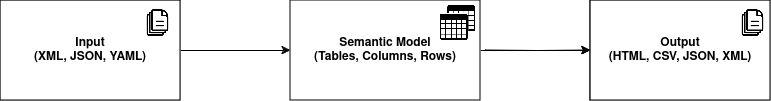
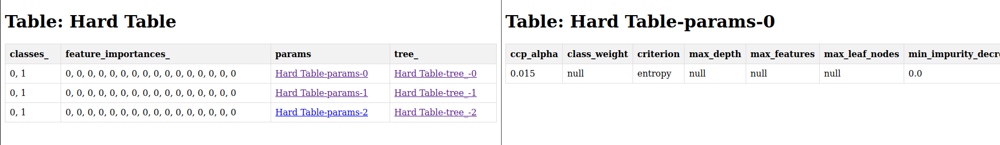
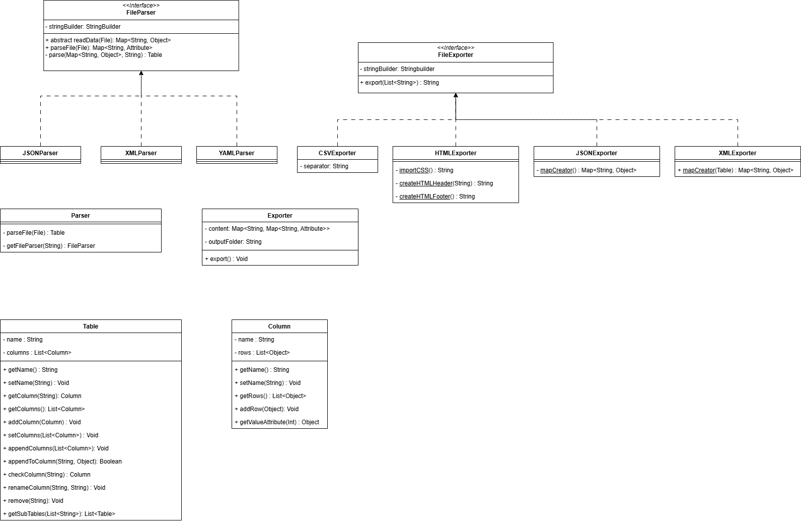
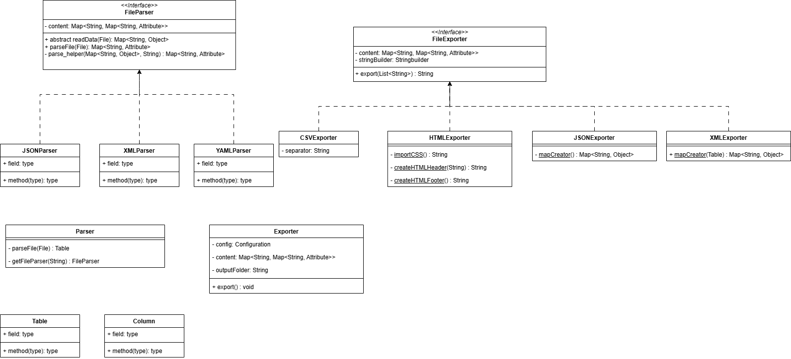

# ELS2024-3: CheckPoint 2

## Introduction

For this checkpoint, our group was tasked with building its very own internal DSL by adapting the code written in the previous checkpoint.
This internal DSL uses Java as its basis and employs a technique called **method chaining** that will be further described in a section bellow.
This DSL, in a way, replaces the previous config file and allows for much of the same operations with the added syntactic layer.

This README contains a section for explaining the structure of the configuration file, a brief description of the major components of the DSL created, as well as the features language is capable of, and the concerns reflected during the its development and the conclusions.

- [Architecture](#architecture)
  - [Input](#parser)
  - [Semantic Model](#processor)
  - [Output](#exporter)
- [Internal DSL](#dsl-architecture)
  - [Builders](#buildrs) 
  - [Config Removal](#config-removal)
  - [Method chaining](#method-chaining)
  - [Error Handling](#error-handling)
- [Features](#features)
  - [Import](#import)
  - [Select](#select)
  - [Column operations](#column-operations)
  - [Assemble](#assemble)
- [Known issues and Limitations](#known-issues-and-limitations)
- [User Profile](#user-profile)
- [Conclusions and Future Work](#conclusions-and-future-work)

## Architecture

The project's architecture was reworked from the previous checkpoint. We can describe the architecture as a 3 step process, staring with the input in the form of files, it's internal representation in the semantic model that allows for operations to be applied to it, and, finally, the output in the form of files containing the transformed data. The image below illustrates this process:

<div style="text-align: center;">
    
    <p>Image 1: DSL architecture's pipeline.</p>
</div>

The following subsections better explain what was changed and introduced when it came to the architecture of this checkpoint.

### Input

We were fortunate in that the parser developed in the previous checkpoint could be used for this one as well. The allowed file extensions also remained the same, those being: **JSON**, **YAML** and **XML**.
The files can be read directly or a directory can be supplied (assuming the files within follow the smae overall strcuture). The parser then interprets them and extracts the relevant information to be processed.

### Semantic Model

After the files have been imported, the semantic model converts them into an internal representation that can be transformed, manipulated and processed.
This area was compleltly reworked from the previous chekpoint. Where before we converted data to Attributes and stored it in a dictionary, we now convert data to the relevant **tables**, each with a list of **columns**.
A table consists of a **name** and a **list of Columns**. **Columns** concist in a **list of Objects** and these can be one of three types:

  - Numbers (Ints, Doubles, Floats...);
  - Strings;
  - Lists (of Numbers, Strings, Tables, ...);
  - Tables.

As we can see above, columns in themselves can also store Tables. This presents us with some recursion, this was very challenging feature to adapt to the semantic model. In later sections we will describe how we handled this behaviour.
This representation is more faithful to the data imported from the files and the expected output. The previous representation of Attributes, while somewhat easy to work with, created a lot of limitations when it came to table operations and column operations. The final table was only created at the time of exportation. This meant that no table joins were support and many column operations were more cumbersome and less intuitive to implement. 
With this new Table representation, the semantic model is more faithful to the problem in question and allows for a much more comprehensive and natural way to process data and alter it.

### Output

The output also suffured some alterations. There are now more exportation options: **HTML**, **JSON**, **XML** and **CSV**. However, the biggest change is that now exportation is supported. In **HTML** and **CSV** files, the output produces the desired file, but also produces one for each recursive table that the user requested. They appear in the original output as their file name. In this way an user can export tables that
have other tables as values in a column. The image bellow shows an example in **HTML**:

<div style="text-align: center;">
    
    <p>Image 2: HTML recursive files.</p>
</div>

As for **XML** and **CSV** files, we can embed this recursive tables in the original file.
With these changes, we believe we added some needed support for some usages the users of our DSL might have.

## Internal DSL

The design of the internal DSL was the bulk of our work for this checkpoint. The language underwent many changes and reworks before landing on a definitive version.
The internal DSL employs **method chaining** that allowed us to build several builders, each with their own behaviours, to craft an API that allowed a user to import data, process it and then export it with  the functions available. The final representation we ended up having consistend in the use of 4 builders that will be better described in the following section.
The following code snipet shows how Bob can execute his experiment using our internal DSL:

```java
Table bobTable = new TableBuilder()

                                .withName("A")

                                .performOperation("Op1")
                                .withImport()
                                    .fromFile("resources/assignment_2/input/vitis-report.xml")
                                        .selectByTable("/AreaEstimates/Resources", null)
                                        .end()
                                    .end()
                                .end()

                                .performOperation("Op2")
                                .withImport()
                                    .fromFile("resources/assignment_2/input/decision_tree.yaml")
                                        .selectByTable(null, List.of("Non-Composite"))
                                        .end()
                                    .end()
                                .end()

                                .performOperation("Op3")
                                .withImport()
                                    .fromFile("resources/assignment_2/input/decision_tree.yaml")
                                        .selectByTable("params", null)
                                        .end()
                                    .end()
                                .end()

                                .performOperation("Op4")
                                    .withImport()
                                        .fromFile("resources/assignment_2/input/profiling.json")
                                            .selectByFilter("/functions/time%", "MAX", List.of("name", "time%"))
                                            .end()
                                        .end()
                                .end()

                                .performOperation("Op5")
                                    .addColumn("Folder", "/output", true)
                                .end()

                                .assemble("resources/assignment_2/output/output_bob.html");
```

As we can see, Bob starts by creating his final table, with the name **A**, he then performs 5 total operation. The first 4 are meant to select and filter tables from different files, and the final ones serves to 
add a column containing the file names. The last line, **assemble**, finally exports the table to Bob's desired file.
We can also provide an example for how Alice, the previous user of our DSL, can execute her use case:

```java
Table aliceTable = new TableBuilder()
        
                                .withName("Alice Table")
        
                                .performOperation("Op1")
                                    .withImport()
                                        .fromFolder("resources/assignment_1/input/", "yaml")
                                            .selectByColumn("params/criterion", null)
                                            .end()
                                        .end()
                                .end()
        
                                .performOperation("Op2")
                                    .withImport()
                                        .fromFolder("resources/assignment_1/input/", "yaml")
                                            .selectByColumn("params/splitter", null)
                                            .addColumn("File", "FILENAME")
                                            .end()
                                        .end()
                                .end()
                                .assemble("resources/assignment_2/output/output_alice.html");
```

The above code executes Alice's example. While a lot more simple than Bob's it is also worth highlighting that in her case we can import an entire folder, as opposed to Bob where, due to them having different structures, he is forced to import each one individually.
In the following subsections we will further explain our approach to the design of this internal DSL.

### Builders

As stated above, the internal DSL employes 4 builders all based on the abstract class **Builder**. Those being: 
  - **TableBuilder**: Tasked with building the final table and exporting it to files of various extensions.
  - **OperationBuilder**: This builder is tasked with starting operations on the final table. And serves as an important syntactic block for the next builders.
  - **ImportBuilder**: This builder is responsible for importing the user's files and parsing them, this builder is also responsible for merging all the tables from the different files and resulting operations into a single one.
  - **SelectBuilder**: Finally, the SelectBuilder is responsible for getting a certain column through some selection methods. It's relative path, some constraints or by a certain table name. This class is also responsible for adding columns and getting values from them through max and min filters.

Method chaining also allowed us to restrict which classes they can call. The following image shows this behaviour:

<div style="text-align: center;">
    
    <p>Image 3: DSL's architecture- Builders.</p>
</div>

<div style="text-align: center;">
    
    <p>Image 4: DLS's architecture. </p>
</div>

As we see above, TableBuilder calls OperationBuilder, this one class ImportBuilder and finally SelectBuilder can be called. This way we can restrict what methods can be called and when, and these constraints add syntactic meaning and structure to our DSL.

### Config Removal

As stated before, for this checkpoint we decided to scrap the config file. We felt that it restricted how we could syntactically represent the problem. Another concern
we had was that it would not serve as a good base for an external DSL. After some analysis and discussion we felt that employing method chaining and building a Java API for our DSL would be the better solution. 

### Method chaining

Method chaining is the technique we emplowed in order to craft our API. The technique consists on using class methods of various classes in a "chain" to perform a certain operation. The advantages of this method is that we can implement some syntactic rules, with the names employed, as well as to restrict their use in an alost grammatical way, as any language would.
This allowed us to implement an internal DSL that is much more aligned to actual languages and employs some syntactic rules. This method will also be very useful to scale to an external DSL as its structure will serve as a sort of intermmidiate representation.

### Error Handling

Our work handles errors in two distinct ways, firstly the internal DSL with its method chaining restricts the use of methods until they make contextual sense. In this way we are preventing errors from occurring using syntactic rules.

The second handles semantic errors. When our code detects incorrect use of methods and classes, it will raise an exeption and stop the execution of the program. It will also warn the user of why the error occured.

## Features

In this checkpoint we added even more features compared to the last iteration, those being:

- Import files directly and from folders;
- We support Table recursivity both in the semantic model and on the output created;
- Filter imports by extension;
- Select data by Table, by constraints, and by column names using relative path;
- Added the same column operations with the addition of max and min;
- Added Table joins. The ImportBuilder is responsible for merging tables, and it can be done horizontaly, where columns are added to the final one, or it can be done vertically where new rows are added to pre-existing columns.
- Supports arithmetic column operation such as sum, subtraction, multiplication and division;
- Supports adding new columns, renaming and removing existing ones.

Each operation creates, in fact, a new column. This means that adding a new column will only information related to the input file associated for each row in the output table. At the moment, it can only be added the following pieces of information:

- File's name, represented in the "content" argument as "FILENAME";
- File's path, represented in the "content" argument as "FILEPATH";

If the other keyword is used, an error is thrown by the error.

We support 4 types of exportation files: **HTML**, **CSV**, **JSON** and **XML**. All of them can handle table recursivity.

This limitation of the keywords and operations were intended to reduce the complexity of the DSL, as well as to limit the language for the requirements and context proposed for this checkpoint.

## Known issues and Limitations

Though our architecture gives the user many features and options to explore it also as some limitations, such as:

- Table sort, pivoting not supported;
- User is forced to learn the syntactics of our internal DSL;
- Some column operations missing like mean, median and mode;
- Using a path to select columns and tables can be somewhat cumbersome;
- Low number of possible constraints for the SelectorBuilder, such as filtering by number ranges, other types than composite and non-composite data (strings, numbers, etc...).

From the last checkpoint, the algorithms implemented have been improved. Due to the new semantic model we can now do operations on only individual tables and columns, improving the efficiency from the last checkpoint.

The group believes that many of these limitations will be solved in the next iterations of our project. For one, the base of the internal DSL is set, this will allow the implementation of new features to be much easier, as we already have a structure that supports it.

## User Profile

For this checkpoint, the user profile differs from the previous one. Where before, a user need not have any expertise or knowledge in programming, it is now a necessity that they have some background knowledge on how Java works and how methods can be called and used. They will also have be familiar with method chaining and be able to program with IDEs.

Once again, to make full use of our work they will also have to have knowledge on the tables and transformations that they intend to use with the API.

## Conclusions and Future Work

The internal DSL improves the functionalities developed of the previous version. In fact, it enhances the importation process, allowing multiple importation, a more granular selection of the data to be imported, as well as providing multiple formats for the file to be exported.

In addition to this, discarding the usage the configuration file and using the method chaining structure gives more freedom to the final user to create the desired process, as well as a more natural and simple way to do so.

As further improvements, it is planned to implement an external DSL from the internal one, adding a GUI to make the UX more intuitive, as well as adding new operations to it.